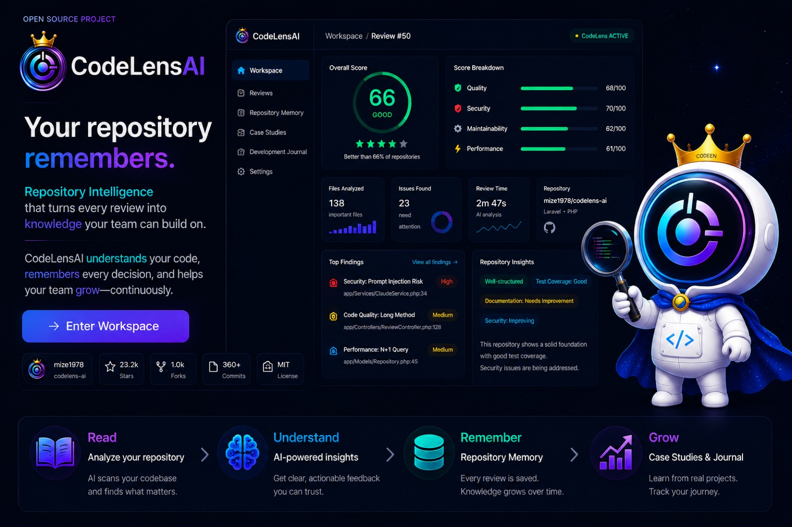

<p align="center">
  
</p>

<h3 align="center">コードではなく、ソフトウェアを読む。</h3>
<p align="center"><b>あなたのリポジトリは、記憶する。</b></p>
<p align="center"><sub>Repository Intelligence はここから。 &nbsp;·&nbsp; <b>Read → Understand → Remember → Grow</b></sub></p>

<p align="center">
  <a href="README.md">English</a> &nbsp;·&nbsp; <b>日本語</b>
</p>

<p align="center">
  
  
  
  
  
  
</p>

<p align="center">
  <a href="https://codelens-ai-vplg.onrender.com/"><b>🖥️ Workspace を開く</b></a>
  &nbsp;·&nbsp;
  <a href="https://mize1978.github.io/codelens-lp/"><b>📖 Landing</b></a>
  &nbsp;·&nbsp;
  <a href="https://mize1978.github.io/codelens-lp/archive.html"><b>📚 Archive</b></a>
  &nbsp;·&nbsp;
  <a href="https://mize1978.github.io/"><b>👤 Portfolio</b></a>
</p>

---

## 単なる AI コードレビューではない

多くのツールは、コードを一度採点して、そのまま忘れる。数字が出て、物語はそこで終わる。

**CodeLensAI は Repository Intelligence Platform です。** 重要なファイルを *読み*、設計を *理解し*、学んだことを *記憶し*、その理解を時間とともに積み上げていく。スコアは結論ではなく、リポジトリが書き続ける本の、ただ一行にすぎない。

> この README は
> **[Landing Page](https://mize1978.github.io/codelens-lp/)** と同じ建物を歩きます — Workspace → Report → Archive → Journal。
> 上から下へ読めば、一度歩いたことになる。

---

## READ — Live Workspace

GitHub の URL を貼ると、その場で *読まれて* いく。ページ再読み込みも、2005年風のローディング画面もない。ここは机。座って、始めるだけ。

<p align="center">
  
</p>

---

## UNDERSTAND — レビューがひとりでに書かれていく

`Read → Understand → Remember` が、起きるそばから流れる。待つのではなく、解析が流れるのを *見て*、最後に *理由* を伴ったスコアに着地する。

<p align="center">
  
</p>

スコアの下には **Repository Insight** — CodeLensくんの一言総評が現れる。さらに Popular Reviews の各カードにも **"CodeLens says"** として一言が並ぶ。「点数を出す AI」ではなく、「リポジトリを見て一言いう CodeLensくん」が立ち上がる瞬間。

そして終わった瞬間、それは画面上のただの数字ではなく、**リポジトリの記憶に書き込まれる。**

<p align="center">
  
</p>
<p align="center"><sub><i>ソフトウェアには記憶がふさわしい。このレビューは、いまリポジトリの記憶の一部になった。</i></sub></p>

---

## REMEMBER — Repository Memory

レビューは使い捨てではない。すべてのレビューがリポジトリの記憶の一部となり、新しい順に棚に並ぶ。履歴はリセットされず、積み上がっていく。**Read → Understand → Remember** が言葉ではなく、成果物になる瞬間。

<p align="center">
  
</p>

---

## GROW — 積み上がる、その証拠

「改善しました」ではない。ここに軌跡がある。実在のリポジトリ **RewardMe** を、同じ軸（品質 / セキュリティ / 保守性）で、修正のたびに再レビューした結果：

<p align="center">
  
</p>

<p align="center">
  <b>総合 49 → 66（+17）</b> &nbsp;·&nbsp; <b>セキュリティ 45 → 70（+25）</b> &nbsp;·&nbsp; すべての伸びを再レビューで検証
</p>

スコアが動いたのは *コード* が動いたから。クライアント任せのスコア → サーバー側検証、ハードコードされたメール `from` → ENV、空のマイグレーション整理。これは主張ではなく、**「直したから、上がった」** です。

---

## 🧠 Repository Intelligence — 「確認できないこと」を「存在しない」と断定しない

CodeLensAI 最大の技術的な核。**きっかけは、自作の別アプリ（RewardMe）をこのツールでレビューしたときの "誤検出" でした。**

- ❌「テストコードが存在しない」 → 実際には RSpec が存在した
- ❌「バリデーションが存在しない」 → 実際にはモデルに存在した

原因は LLM の性能ではなく、**AI に渡す前の "コンテキスト設計"** でした。全ファイルから重要な一部だけを選び、本文も途中で切っていたのに、AI には「これで全部」かのように渡していた。だから AI は **「読めていない範囲」を「存在しない」** と解釈してしまう。

そこで、次の3つを分けて AI に渡すようにしました：

| 層 | 役割 |
|---|---|
| **RepositoryFacts** | 何が存在するか（`detected / none / unknown` を厳密に区別。`unknown` を `none` に変換しない） |
| **EvidenceCoverage** | AI が今回どこまで読めたか（subset か・各ファイルが何文字中何文字＝truncated か） |
| **Prompt Contract / Scoring Rubric** | 「未確認を不在として減点しない」「矛盾したら事実を優先」を、プロンプトと採点の両方に反映 |

**同じリポジトリを改善前後で再レビューし、既知の誤検出2件を除去しつつ本当の指摘は維持できることを確認**してから本番に反映しました。「慎重にして指摘が減った」のではなく、**「間違いだけが消えた」**。

> "AI にもっと読ませる" のではなく、**"読んでいないことを AI 自身に認識させる"**。
> 設計の詳細 → [`docs/repository-intelligence.md`](docs/repository-intelligence.md)

---

## THE LIBRARY — Repository Intelligence Archive

記憶は、やがて **図書館** へと自らを整理していく。すべてのレビュー・研究・原則が、棚の一冊になる。ここで解析は **ナレッジ OS** になる — ログではなく、歩いて回れる場所。

<p align="center">
  
</p>

- 📘 **Repository DNA** · レビューを重ねてリポジトリに蓄積される思想と性格
- 📚 **Review History** · レビューされた各リポジトリの進化タイムライン
- 💡 **Case Study** · RewardMe がどう伸びたかを研究論文として
- 🎨 **Design Bible** · CodeLensAI の設計原則
- 📗 **Knowledge Base** · コードとアイデアの百科事典

<p align="center">
  <a href="https://mize1978.github.io/codelens-lp/archive.html"><b>→ Repository Intelligence Archive へ</b></a>
</p>

---

## THE LIVING BOOK — Development Journal

棚のどの本も完結している。ひとつを除いて。**Development Journal** は、いまも書かれ続けている巻 — プロダクトが育つたびに、新しいページが増える。

<p align="center">
  
</p>
<p align="center"><sub><b>CURRENTLY READING · VOL.01 —「Workspace became home.」</b></sub></p>

<p align="center">
  <a href="https://mize1978.github.io/codelens-lp/journal-vol01.html"><b>→ Development Journal VOL.01 を読む</b></a>
</p>

---

<p align="center"><i>この書庫は生きている。レビューのたびに、また一ページ書かれる。</i></p>

---

## 🛠️ 技術スタック

| レイヤー      | 技術                                   |
|--------------|----------------------------------------|
| フレームワーク | Laravel 13 / PHP 8.4                    |
| ビュー / UI   | Blade + Tailwind CSS + Vite            |
| データベース  | PostgreSQL                             |
| AI           | Anthropic Claude API                    |
| 外部連携      | GitHub REST API                         |
| 非同期処理    | Queue worker（レビューを非同期ジョブで実行） |
| テスト        | PHPUnit（認識ロジックは実API非依存で検証）  |
| インフラ      | Docker / Docker Compose / Render        |

---

## 🐳 セットアップ

```bash
# 1. クローン
git clone https://github.com/mize1978/codelens-ai.git
cd codelens-ai

# 2. 環境変数
cp .env.example .env
# APP_KEY と API キー（ANTHROPIC_API_KEY, GITHUB_TOKEN など）を設定

# 3. Docker で起動
docker compose up -d

# 4. マイグレーション
docker compose exec app php artisan key:generate
docker compose exec app php artisan migrate --seed
```

アプリは http://localhost:3003 で起動します。

> 公開デモでは Claude API コスト保護のため、レビュー回数に上限があります（1 IP / 1日3回・サービス全体 / 1日30回。キャッシュヒットはカウント対象外）。

---

## 📄 ライセンス

MIT License で公開しています。

<p align="center">
  Made with ☕ by <b>Mize</b> & <b>CodeLens-kun</b> 👑<br>
  <sub><i>LP は入口。Workspace は場所。レポートは本になり、知識は記憶になる。</i></sub>
</p>

---

<p align="center">
  <a href="https://codelens-ai-vplg.onrender.com/">
    
  </a>
</p>

<p align="center">
  <a href="https://codelens-ai-vplg.onrender.com/"><b>➡ &nbsp; Workspace を開く &nbsp; →</b></a>
</p>
