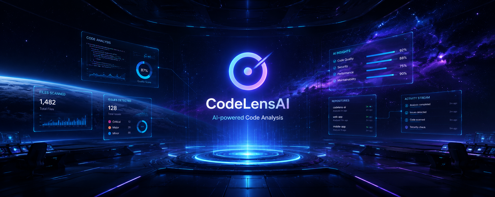
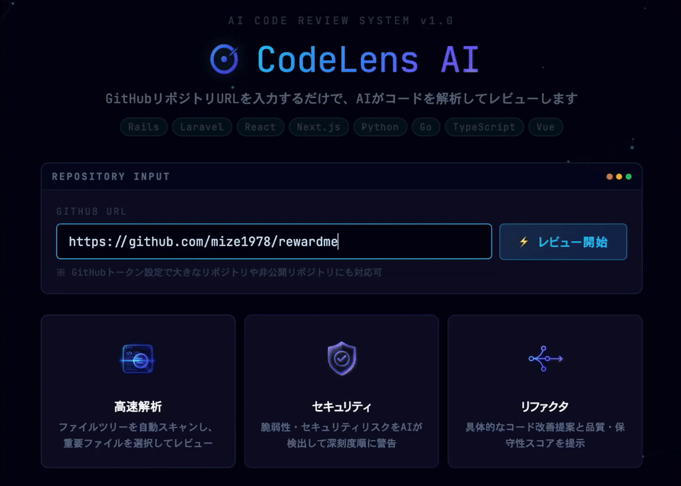
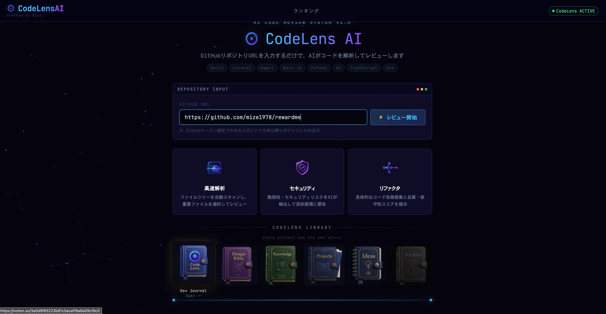
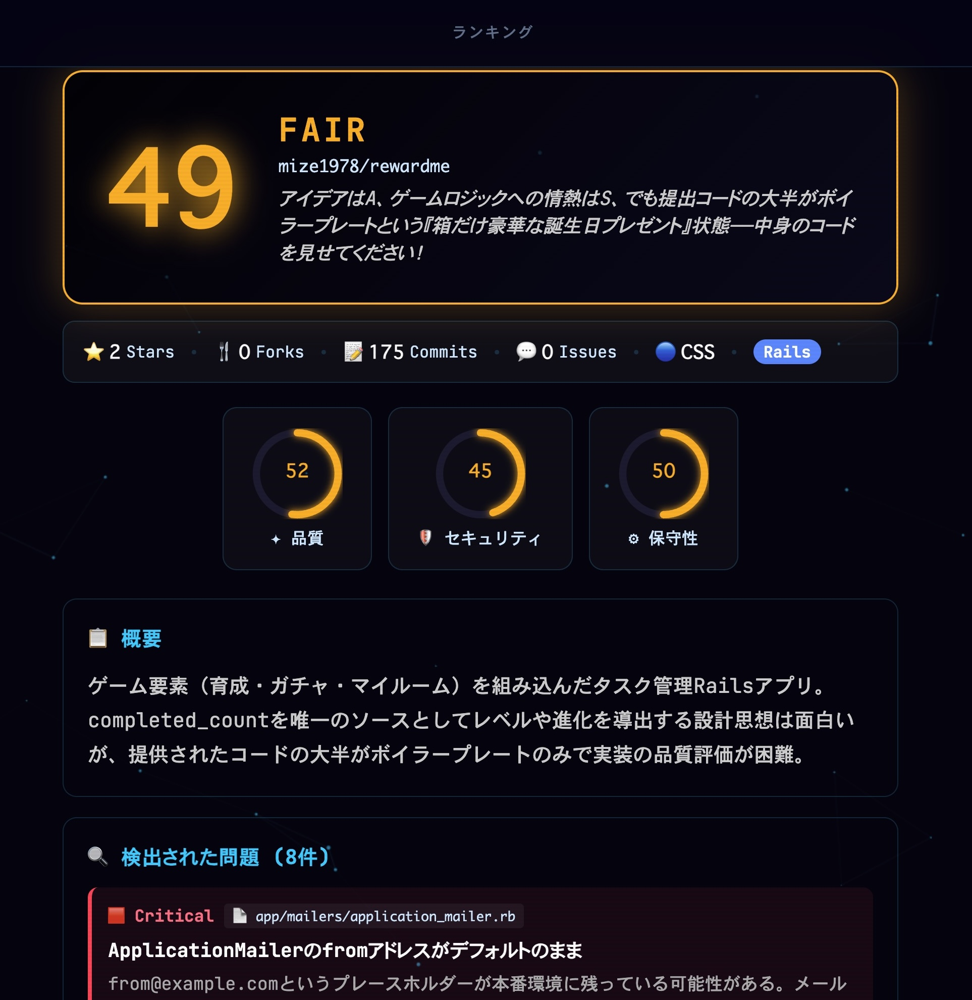
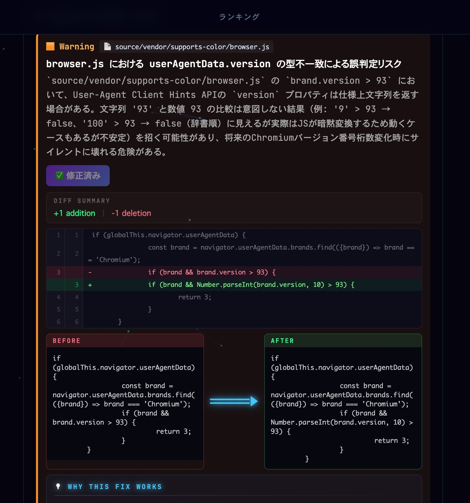
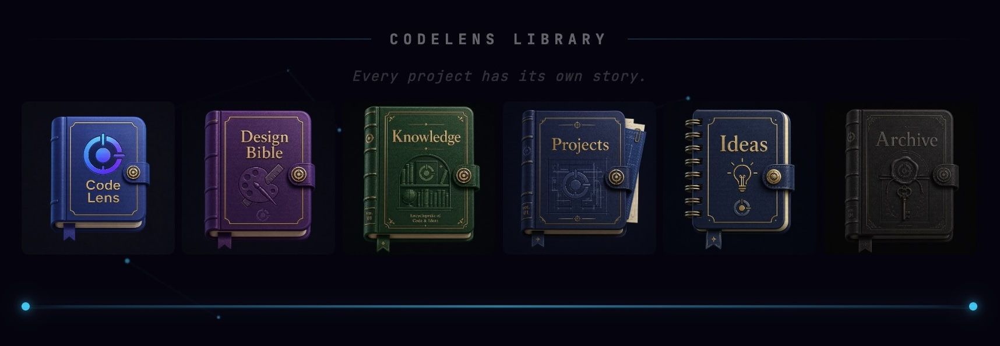
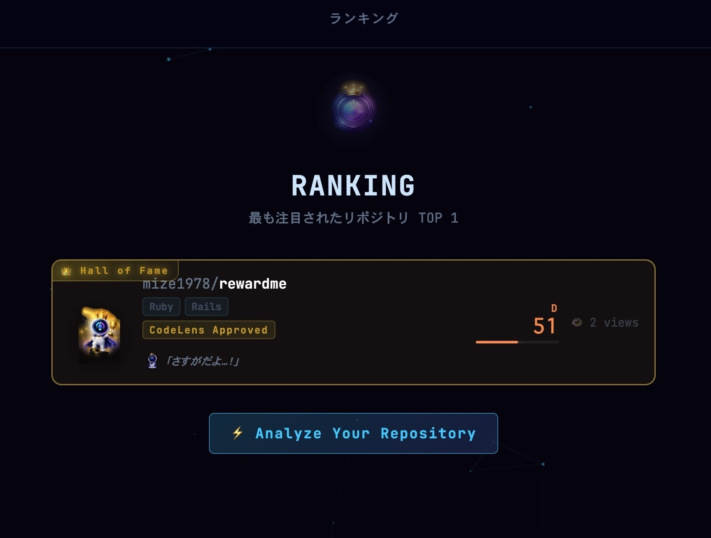

<p align="center">
  
</p>
<h1 align="center">CodeLensAI</h1>
<p align="center">
  <b>AI-powered code review that turns feedback into a learning experience.</b>
</p>
<p align="center">
  Analyze any GitHub repository with AI, receive actionable feedback, prioritize issues with severity scoring,
  generate AI-powered fixes, and level up your code quality—with a little help from CodeLens-kun.
</p>
<p align="center">
  
  
  
  
  
</p>

---

## ✨ Overview

CodeLensAI reviews GitHub repositories the way a thoughtful senior engineer would — but instantly.
Point it at a repo, and it scans the code, scores overall quality, flags issues by severity, and
explains why each one matters so the feedback actually teaches you something. Great reviews are
saved to your Library (Dev Journal), allowing you to build a personal knowledge base over time.

---

## 🚀 Features

- **AI Code Review** — Analyze any GitHub repository and receive an overall quality score.
- **Severity Badges** — Prioritize issues based on severity.
- **AI Fix Suggestions** — Generate one-click fixes and exportable PR comments.
- **GitHub Stats** — View stars, forks, commits, and language at a glance.
- **Ranking** — Compare repositories through a gamified leaderboard.
- **CodeLens Library (Dev Journal)** — Save reviews as collectible books linked with your Notion workspace.
- **CodeLens-kun** — Your AI companion with live animations during code analysis.

---

## 🎬 Demo

<p align="center">
  
</p>
<p align="center">
  <sub>▶️ Want it with sound? Drag <code>demo.mp4</code> into the GitHub README editor to embed a video player.</sub>
</p>

---

## 🖼️ Screenshots

**📸 Dashboard**
Paste a GitHub repository URL and start an AI review.

<p align="center">
  
</p>

<table align="center"><tr>
<td align="center" width="50%"><b>🤖 AI Review</b><br>Get an overall quality score, issue breakdown, and actionable feedback.<br><br></td>
<td align="center" width="50%"><b>🔧 AI Fix Suggestions</b><br>Review before/after diffs, understand why each fix works, and see your estimated score improve.<br><br></td>
</tr></table>

**📚 CodeLens Library (Dev Journal)**
Every project has its own story.

<p align="center">
  
</p>

**🏆 Ranking**
Compare reviewed repositories on the leaderboard.

<p align="center">
  
</p>

---

## 🛠️ Tech Stack

| Layer       | Technology                  |
|-------------|-----------------------------|
| Framework   | Laravel (PHP)               |
| Views / UI  | Blade + Tailwind CSS        |
| Database    | MySQL                       |
| AI          | Anthropic Claude API        |
| Infra       | Docker / Docker Compose     |

---

## 🐳 Getting Started

```bash
# 1. Clone
git clone https://github.com/mize1978/codelens-ai.git
cd codelens-ai

# 2. Environment
cp .env.example .env
# set your APP_KEY and API keys (e.g. ANTHROPIC_API_KEY, GITHUB_TOKEN)

# 3. Boot with Docker
docker compose up -d

# 4. App migrations
docker compose exec app php artisan key:generate
docker compose exec app php artisan migrate --seed
```

The app runs at http://localhost:3003.

---

## 🗺️ Roadmap

- [ ] Support private repositories via GitHub OAuth
- [ ] Multi-language deep analysis
- [ ] Team dashboards & shared rankings
- [ ] Export reviews as PDF / shareable cards
- [ ] Deeper Notion / Dev Journal integration

---

## 📄 License

Released under the MIT License.

<p align="center">
  Made with ☕ by <b>Mize</b> & <b>CodeLens-kun</b> 👑
</p>
