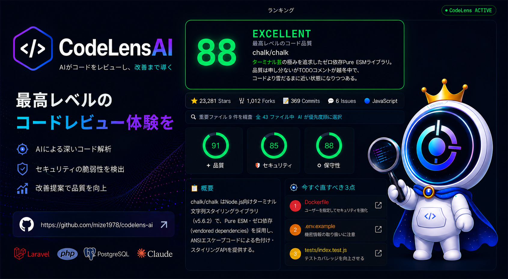
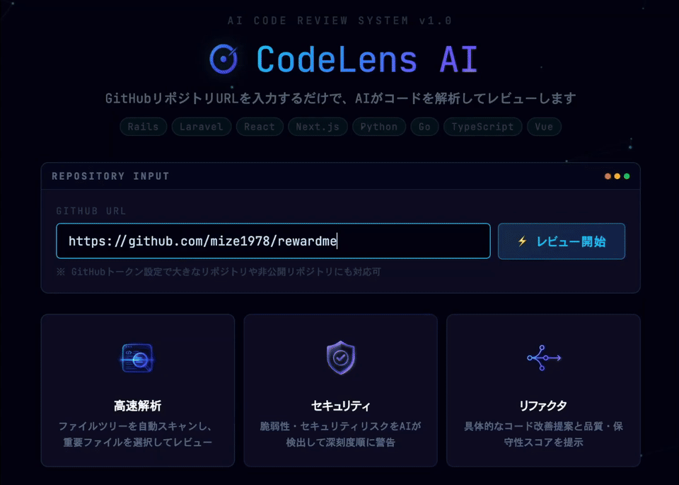
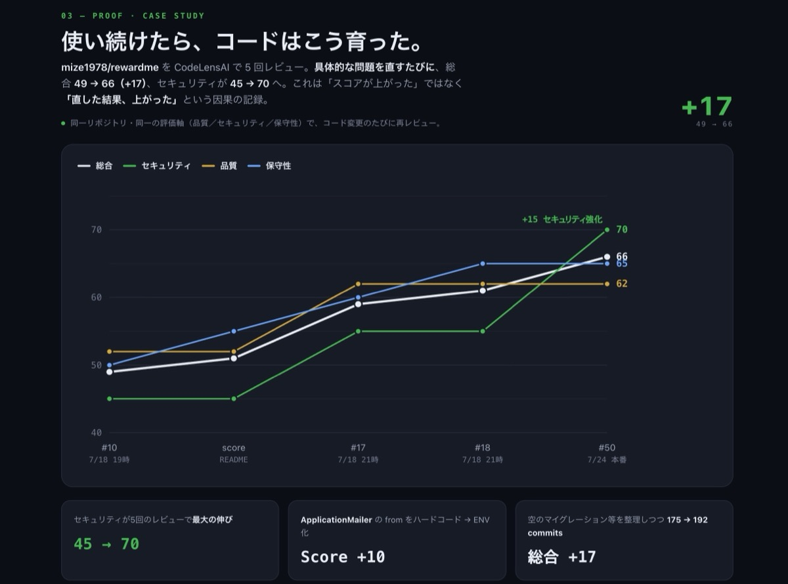
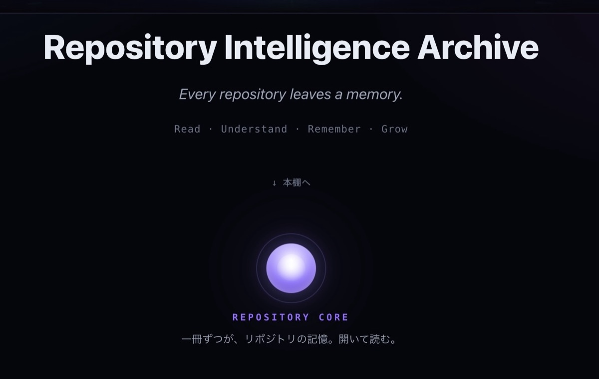
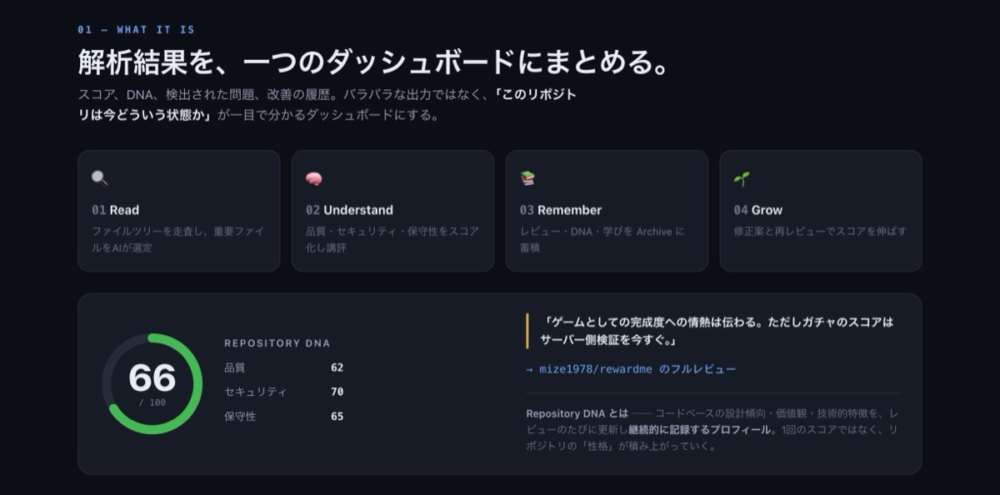
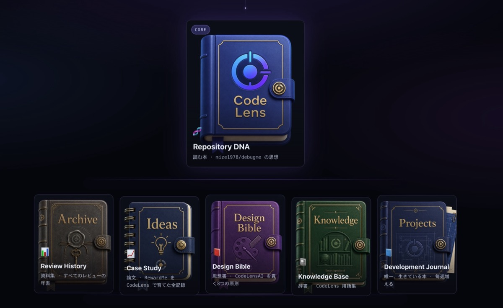
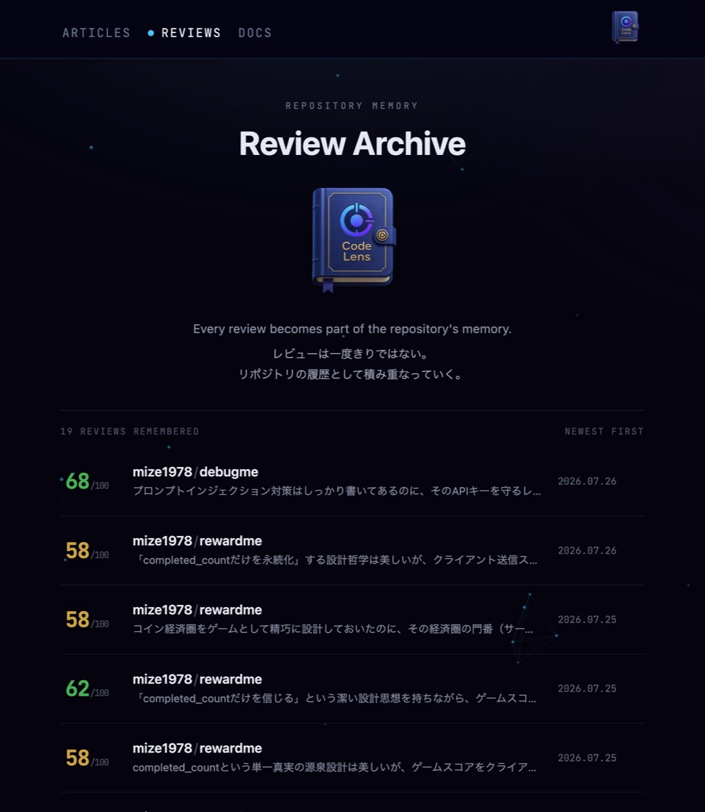
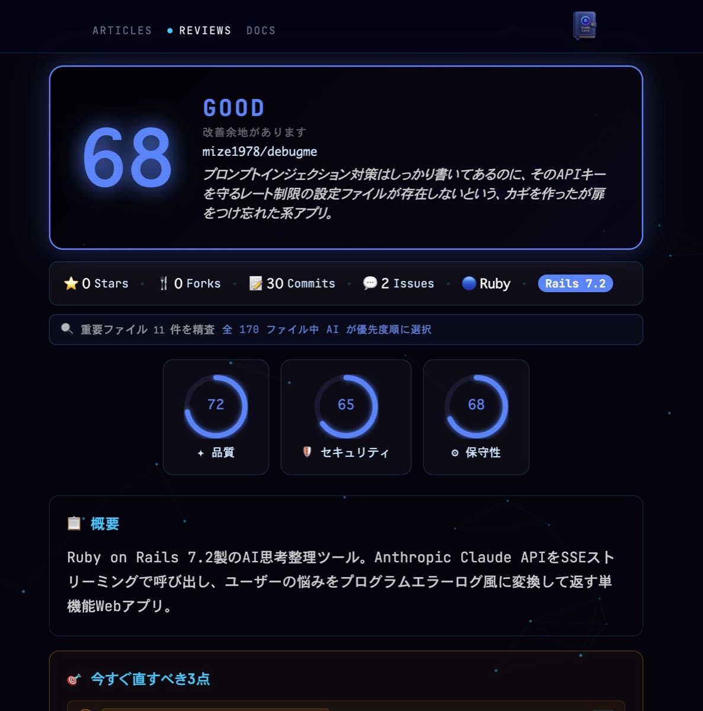
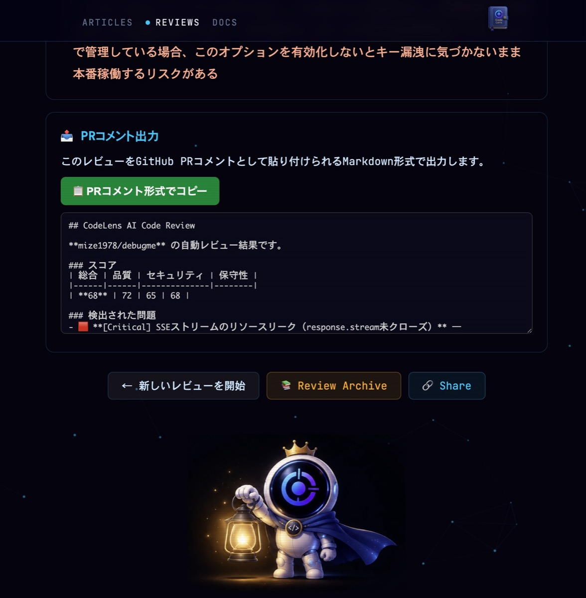
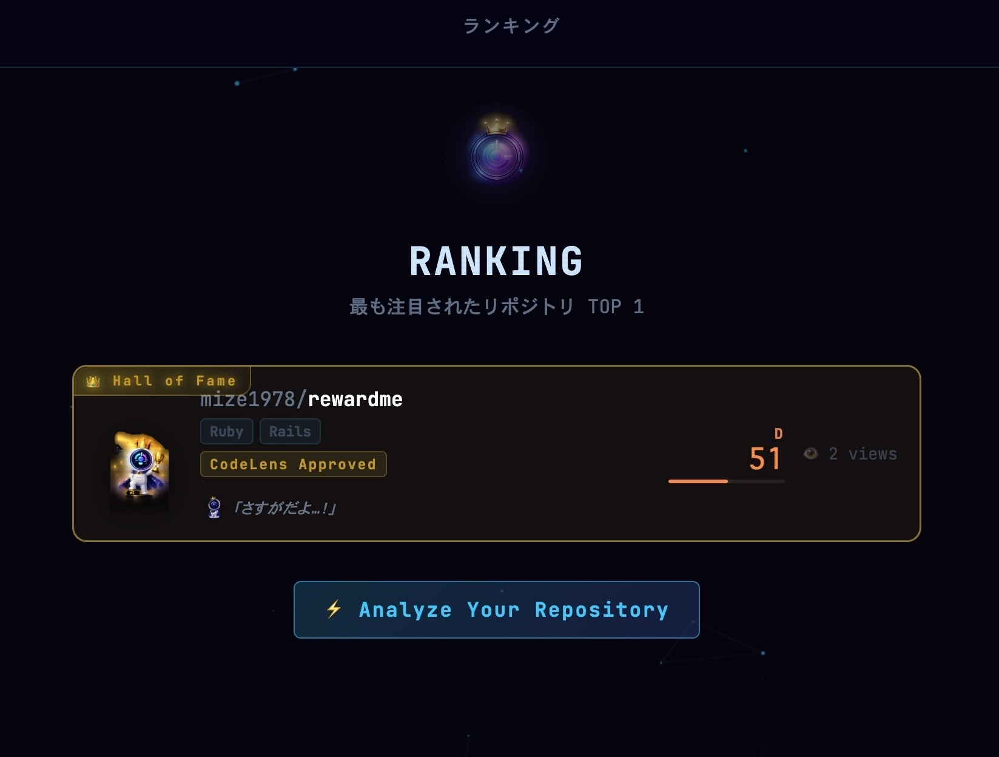

<p align="center">
  
</p>

<h3 align="center">Repository Intelligence.</h3>
<p align="center"><b>Your repository remembers.</b></p>

<p align="center">
  Paste any GitHub URL. CodeLensAI <b>reads</b> it, <b>understands</b> it, and <b>remembers</b> it —<br>
  every review becomes part of your repository's memory.
</p>

<p align="center">
  
  
  
  
  
</p>

<p align="center">
  <a href="https://codelens-ai-vplg.onrender.com"><strong>🚀 Live Demo</strong></a>
  &nbsp;·&nbsp;
  <a href="https://mize1978.github.io/codelens-lp/archive.html"><strong>📚 Repository Intelligence Archive</strong></a>
</p>

---

## Not just an AI code reviewer

Most tools score your code once, then forget it. A number appears, and the story ends there.

**CodeLensAI is a Repository Intelligence Platform.** It treats every review as *memory* — it reads the
important files, understands the design, remembers what it learned, and lets that understanding compound
over time. The score isn't the conclusion. It's one line in a book your repository keeps writing.

> This README is a **guided tour**. Scroll top to bottom and you walk the whole world — from the desk
> where you analyze, through the heart that holds the memory, to the library where every review is kept.

---

## The Loop — Read → Understand → Remember → Grow

Every review moves through four verbs. This is the whole product in one line.

| | | |
|---|---|---|
| **Read** | Selects the important files first | It reads the core, the way a senior engineer would |
| **Understand** | Quality · Security · Maintainability | Deterministic — the same commit returns the same score |
| **Remember** | Writes the review to the repository's memory | A review is not a one-off. It's shelved. |
| **Grow** | Understanding compounds across reviews | The next review stacks on the history of the last |

---

## 🖥️ Live Workspace — where you analyze

Paste a GitHub URL and watch it get *read* in place — no page reloads, no 2005 loading screen. This is
the desk. You sit down and start.

<p align="center">
  
</p>

---

## ⚡ Live Review — the AI generates the review

`Read → Understand → Remember` streams as it happens. You don't wait — you watch analysis flow.

<p align="center">
  
</p>
<p align="center"><sub><b>Analyze → Review → Archive</b> — one continuous room, from URL to memory.</sub></p>

---

## 📈 Proof — it actually grows

Not "we improved things." Here is the trajectory. **RewardMe**, a real repository, reviewed five times —
same repo, same axes (Quality / Security / Maintainability), re-reviewed after every fix:

<p align="center">
  
</p>

<p align="center">
  <b>Overall 49 → 66 (+17)</b> &nbsp;·&nbsp; <b>Security 45 → 70 (+25)</b> &nbsp;·&nbsp; every gain verified by re-review
</p>

The score moved because the *code* moved: client-trusted gacha scores → server-side validation,
hardcoded mail `from` → ENV, empty migrations cleaned up. This is **"fixed, therefore rose"** — not a claim.

---

## 💜 Repository Core — every repository has a center

Before the books, there is a **heart**. The Repository Core is where memory lives and breathes — a living
center that holds everything a repository has learned. It's not a button; it's the pulse of the whole world.

<p align="center">
  
</p>
<p align="center"><sub><b>Every repository leaves a memory.</b></sub></p>

---

## 🧬 Repository DNA — the memory that accumulates

Around that center, something builds up. Each review updates the **Repository DNA** — a living profile of
the codebase's design, values, and character. Not a single score you glance at, but a *personality* that
thickens review after review.

<p align="center">
  
</p>
<p align="center"><sub>Read → Understand → <b>Remember</b> — this is where "Remember" stops being a word and becomes an artifact.</sub></p>

---

## 📚 Library — the DNA becomes books

The memory organizes itself into a **library**. Every review, every study, every principle takes the form
of a book on the shelf. This is where analysis turns into a **knowledge OS** — not a log, a place you walk
through.

<p align="center">
  
</p>

- 📘 **Repository DNA** · the philosophy the repo is built on
- 📚 **Review History** · the evolution timeline of every reviewed repo
- 💡 **Case Study** · how RewardMe grew, written as a research paper
- 🎨 **Design Bible** · the principles behind CodeLensAI
- 📗 **Knowledge Base** · the encyclopedia of code & ideas
- 📓 **Development Journal** · the one book that's never finished; it grows weekly

<p align="center">
  <a href="https://mize1978.github.io/codelens-lp/archive.html"><b>→ Enter the Repository Intelligence Archive</b></a>
</p>

---

## 📖 Open a Book — the Review Archive

Take one down. Every review is shelved here, newest first — a repository of memories you can browse.

<p align="center">
  
</p>

---

## 📄 Review Report — read the evaluation

Open a book and the full review is waiting: overall score, issues ranked by severity, *why each one
matters*, one-click fixes, and exportable PR comments. This is the **evaluation** — a report you can
return to, not a number you glance at once.

<p align="center">
  
</p>

---

## 🕯️ Read the Story — close the book

When you reach the end of a review, the librarian is there — lantern lit, the light still on. The
evaluation is done; what remains is the **afterglow**. Close the book, and the shelf keeps it. The
repository remembers.

<p align="center">
  
</p>

---

## 🏆 Ranking — the world beyond your repo

Compare repositories, discover rising projects, and climb the leaderboard — deduped to one latest review
per repo, so it reflects the current state, not noise.

<p align="center">
  
</p>

---

## 🛠️ Tech Stack

| Layer       | Technology                  |
|-------------|-----------------------------|
| Framework   | Laravel (PHP)               |
| Views / UI  | Blade + Tailwind CSS        |
| Database    | PostgreSQL                  |
| AI          | Anthropic Claude API        |
| Async       | Queue workers (async review jobs) |
| Infra       | Docker / Docker Compose     |

---

## 🐳 Getting Started

```bash
# 1. Clone
git clone https://github.com/mize1978/codelens-ai.git
cd codelens-ai

# 2. Environment
cp .env.example .env
# set your APP_KEY and API keys (e.g. ANTHROPIC_API_KEY, GITHUB_TOKEN)

# 3. Boot with Docker
docker compose up -d

# 4. App migrations
docker compose exec app php artisan key:generate
docker compose exec app php artisan migrate --seed
```

The app runs at http://localhost:3003.

---

## 🗺️ Roadmap

The Archive is designed to keep growing. Next volumes & features:

- [ ] Repository Intelligence Archive as a first-class in-app floor (not just the static library)
- [ ] Support private repositories via GitHub OAuth
- [ ] Multi-language deep analysis
- [ ] Team dashboards & shared rankings
- [ ] Export reviews as PDF / shareable cards

---

## 📄 License

Released under the MIT License.

<p align="center">
  Made with ☕ by <b>Mize</b> & <b>CodeLens-kun</b> 👑<br>
  <sub><i>Repository Intelligence begins here.</i></sub>
</p>
