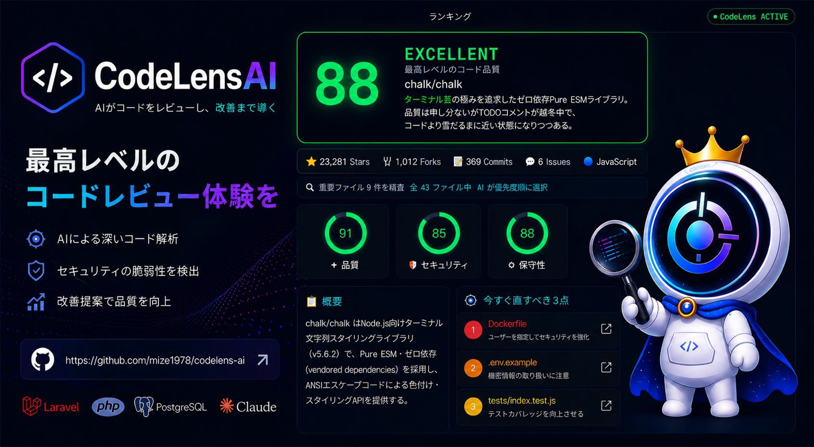
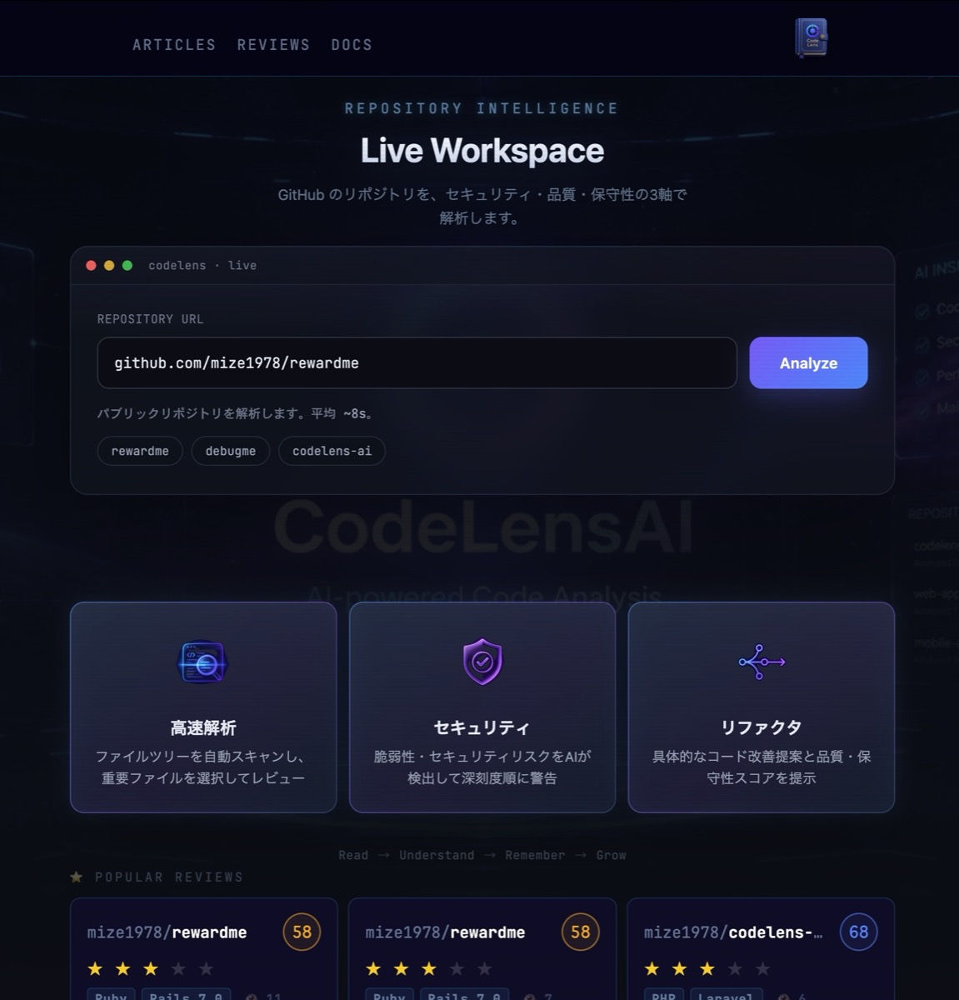
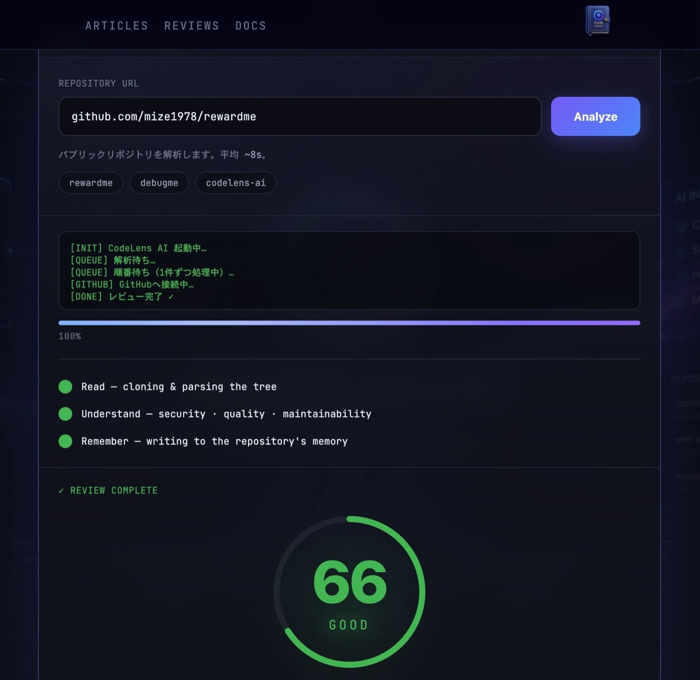
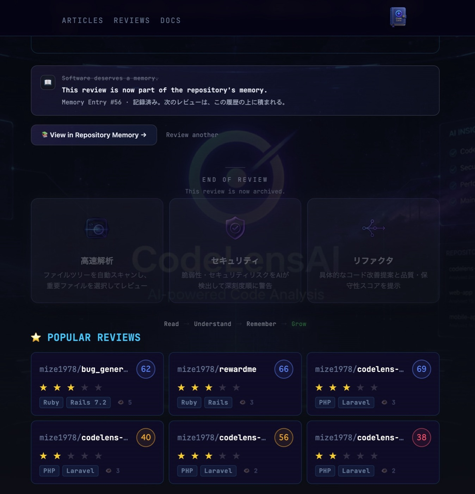
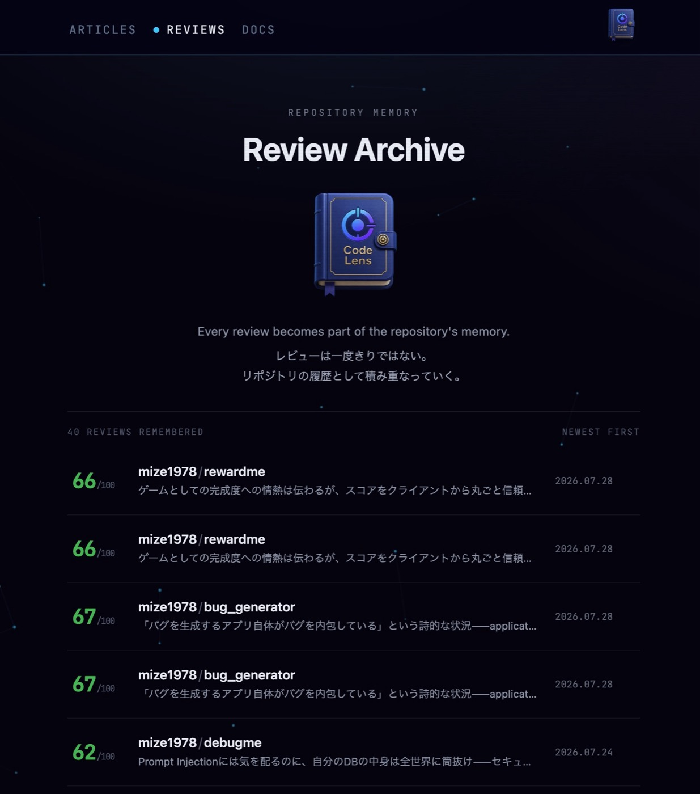
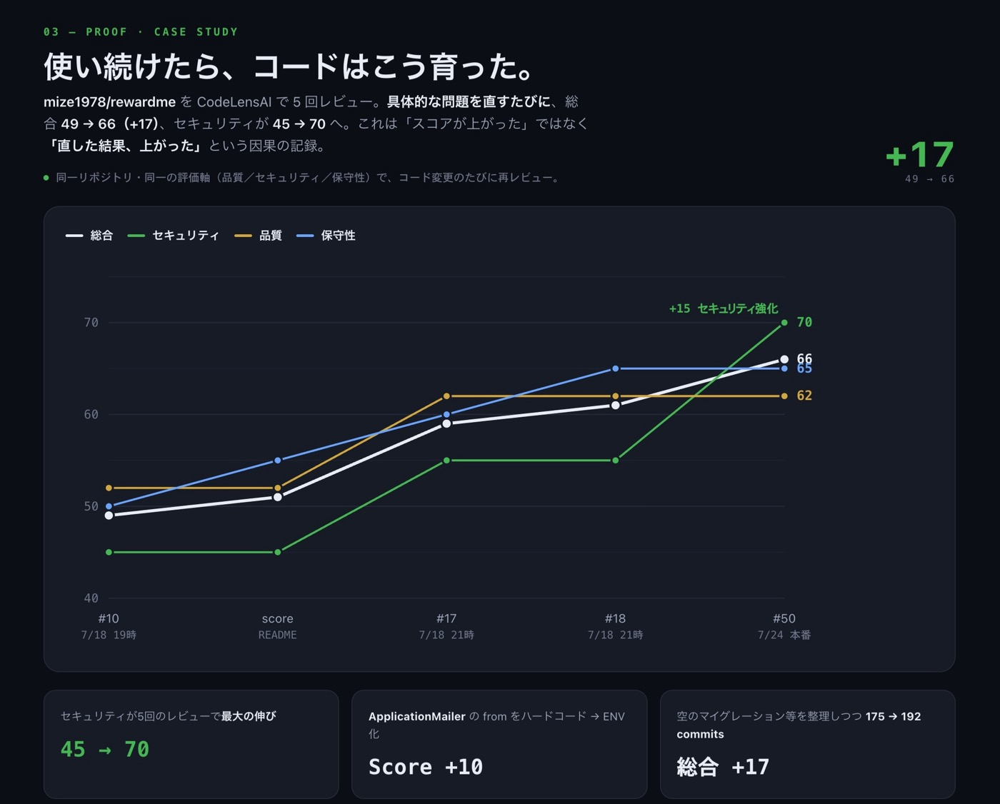
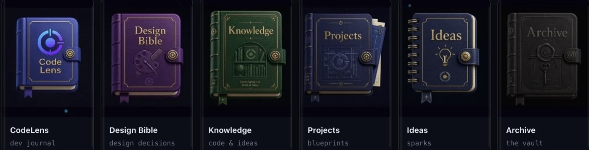
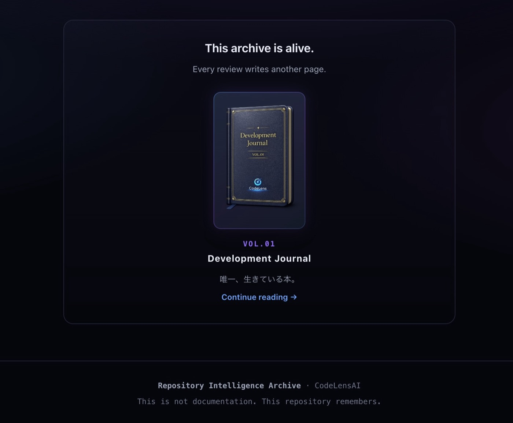
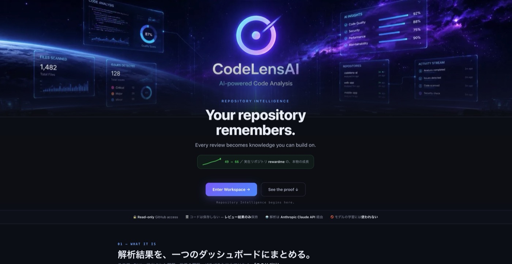

<p align="center">
  
</p>

<h3 align="center">Read software, not just code.</h3>
<p align="center"><b>Your repository remembers.</b></p>
<p align="center"><sub>Repository Intelligence begins here. &nbsp;·&nbsp; <b>Read → Understand → Remember → Grow</b></sub></p>

<p align="center">
  
  
  
  
  
</p>

<p align="center">
  <a href="https://codelens-ai-vplg.onrender.com/"><b>🖥️ Enter Workspace</b></a>
  &nbsp;·&nbsp;
  <a href="https://mize1978.github.io/codelens-lp/"><b>📖 Landing</b></a>
  &nbsp;·&nbsp;
  <a href="https://mize1978.github.io/codelens-lp/archive.html"><b>📚 Archive</b></a>
  &nbsp;·&nbsp;
  <a href="https://glaze-turn-b67.notion.site/Development-Journal-3a0d9f65223b81c5acaff8a6a09cf9c0"><b>📘 Development Journal</b></a>
  &nbsp;·&nbsp;
  <a href="https://mize1978.github.io/"><b>👤 Portfolio</b></a>
</p>

---

## Not just an AI code reviewer

Most tools score your code once, then forget it. A number appears, and the story ends there.

**CodeLensAI is a Repository Intelligence Platform.** It reads the important files, understands the
design, remembers what it learned, and lets that understanding compound over time. The score isn't the
conclusion — it's one line in a book your repository keeps writing.

> This README walks the same building as the
> **[Landing Page](https://mize1978.github.io/codelens-lp/)** — Workspace → Report → Archive → Journal.
> Scroll top to bottom and you walk it once.

---

## READ — Live Workspace

Paste a GitHub URL and watch it get *read* in place — no page reloads, no 2005 loading screen. This is
the desk. You sit down and start.

<p align="center">
  
</p>

---

## UNDERSTAND — the review writes itself

`Read → Understand → Remember` streams as it happens. You don't wait — you watch analysis flow, then land
on a score with the *why* behind it.

<p align="center">
  
</p>

And the moment it finishes, it isn't just a number on screen — it's **written to the repository's memory.**

<p align="center">
  
</p>
<p align="center"><sub><i>Software deserves a memory. This review is now part of the repository's.</i></sub></p>

---

## REMEMBER — Repository Memory

A review is not a one-off. Every review becomes part of the repository's memory — shelved, newest first,
so history compounds instead of resetting. **Read → Understand → Remember** stops being words and becomes
an artifact.

<p align="center">
  
</p>

---

## GROW — the proof it compounds

Not "we improved things." Here is the trajectory. **RewardMe**, a real repository, reviewed five times —
same repo, same axes (Quality / Security / Maintainability), re-reviewed after every fix:

<p align="center">
  
</p>

<p align="center">
  <b>Overall 49 → 66 (+17)</b> &nbsp;·&nbsp; <b>Security 45 → 70 (+25)</b> &nbsp;·&nbsp; every gain verified by re-review
</p>

The score moved because the *code* moved: client-trusted scores → server-side validation, hardcoded mail
`from` → ENV, empty migrations cleaned up. This is **"fixed, therefore rose"** — not a claim.

---

## THE LIBRARY — Repository Intelligence Archive

The memory organizes itself into a **library**. Every review, study, and principle becomes a book on the
shelf. This is where analysis turns into a **knowledge OS** — not a log, a place you walk through.

<p align="center">
  
</p>

- 📘 **Repository DNA** · the philosophy and character a repo accumulates review after review
- 📚 **Review History** · the evolution timeline of every reviewed repo
- 💡 **Case Study** · how RewardMe grew, written as a research paper
- 🎨 **Design Bible** · the principles behind CodeLensAI
- 📗 **Knowledge Base** · the encyclopedia of code & ideas

<p align="center">
  <a href="https://mize1978.github.io/codelens-lp/archive.html"><b>→ Enter the Repository Intelligence Archive</b></a>
</p>

---

## THE LIVING BOOK — Development Journal

Every book on the shelf is finished. One isn't. The **Development Journal** is the volume still being
written — a new page every time the product grows.

<p align="center">
  
</p>
<p align="center"><sub><b>CURRENTLY READING · VOL.01 — “Workspace became home.”</b></sub></p>

<p align="center">
  <a href="https://glaze-turn-b67.notion.site/Development-Journal-3a0d9f65223b81c5acaff8a6a09cf9c0"><b>→ Read the Development Journal</b></a>
</p>

---

<p align="center"><i>This archive is alive. Every review writes another page.</i></p>

---

## 🛠️ Tech Stack

| Layer       | Technology                        |
|-------------|-----------------------------------|
| Framework   | Laravel (PHP)                     |
| Views / UI  | Blade + Tailwind CSS              |
| Database    | PostgreSQL                        |
| AI          | Anthropic Claude API              |
| Async       | Queue workers (async review jobs) |
| Infra       | Docker / Docker Compose / Render  |

---

## 🐳 Getting Started

```bash
# 1. Clone
git clone https://github.com/mize1978/codelens-ai.git
cd codelens-ai

# 2. Environment
cp .env.example .env
# set your APP_KEY and API keys (e.g. ANTHROPIC_API_KEY, GITHUB_TOKEN)

# 3. Boot with Docker
docker compose up -d

# 4. App migrations
docker compose exec app php artisan key:generate
docker compose exec app php artisan migrate --seed
```

The app runs at http://localhost:3003.

---

## 📄 License

Released under the MIT License.

<p align="center">
  Made with ☕ by <b>Mize</b> & <b>CodeLens-kun</b> 👑<br>
  <sub><i>LP is the entrance. Workspace is the place. Reports become books. Knowledge becomes memory.</i></sub>
</p>

---

<p align="center">
  <a href="https://codelens-ai-vplg.onrender.com/">
    
  </a>
</p>

<h3 align="center">Your repository remembers.</h3>
<p align="center"><sub>Repository Intelligence begins here.</sub></p>
<p align="center">
  <a href="https://codelens-ai-vplg.onrender.com/"><b>➡ &nbsp; Enter Workspace &nbsp; →</b></a>
</p>
